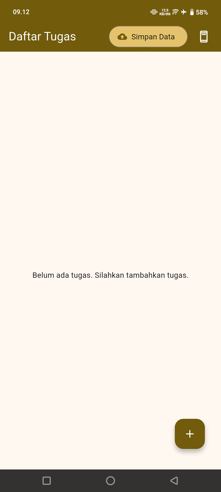
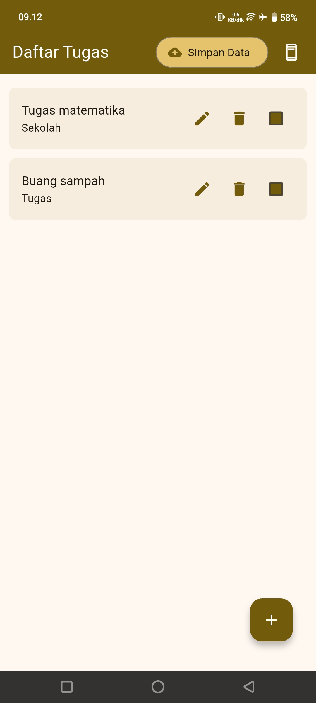
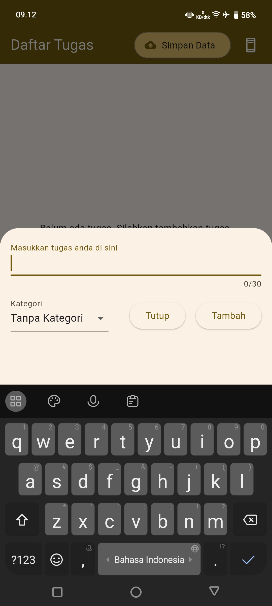
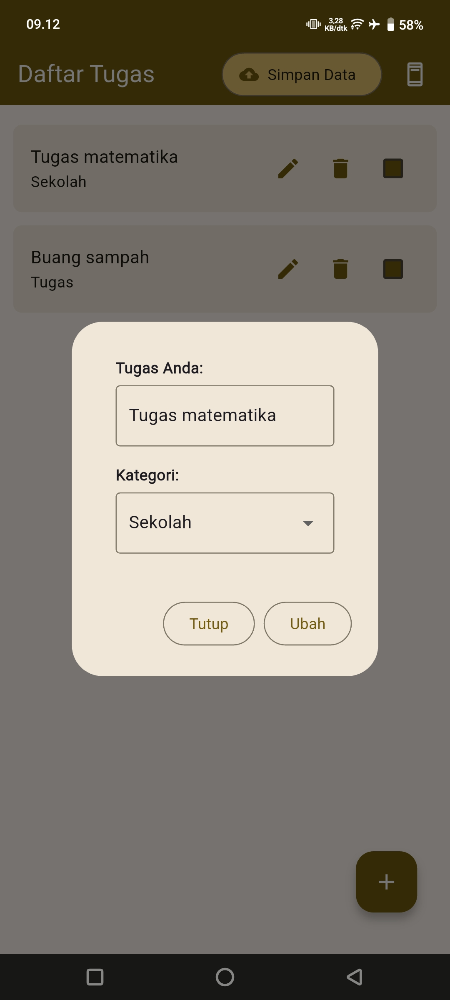
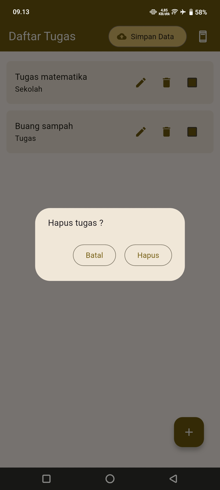
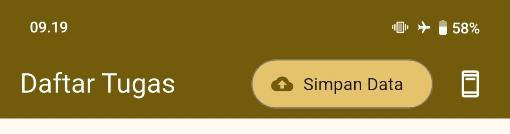

# Aplikasi to-do list

Aplikasi to-do list menggunakan Flutter

---

## 📱 Fitur

- ✅ Add, edit, delete tugas
- ☑️ Menandai tugas sudah selesai atau belum
- 💾 Offline database lokal menggunakan `sqflite`
- 🔁 Menggunakan Firebase untuk penyimpanan di cloud

---

## Berikut merupakan screenshot dari aplikasi to-do list

### > Halaman utama

### > Tambah data

### > Edit data

### > Delete data

---

### Pada AppBar terdapat dua tombol yang berfungsi masing - masing menyimpan data dari lokal ke cloud (Firebase) dan sebaliknya.

Untuk tombol yang sebelah kiri berfungsi untuk menyimpan data di cloud (Firebase) dengan menyalin seluruh data di lokal kemudian menggantikan seluruh data di cloud.
Tombol sebelah kanan untuk menyalin seluruh data di cloud (Firebase) dan mengganti seluruh data di lokal.

---

# Download APK

### APK terdapat pada folder berikut ini :
[Download Apk todo_list](apk/)

